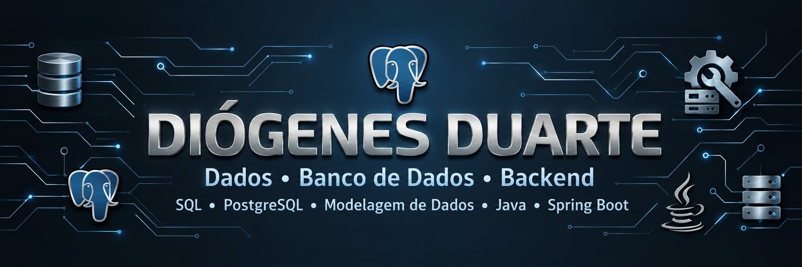

## Sobre mim

Sou **Diógenes Duarte**, estudante de **Engenharia de Software na Estácio** e técnico em Eletrotécnica, em transição de carreira para **Dados, Banco de Dados e Backend**.

Minha experiência com logística e estoque de peças automotivas me aproximou de problemas reais de consulta, organização e confiabilidade das informações. Hoje, desenvolvo projetos para transformar essas necessidades em bancos de dados, análises e aplicações.

Busco minha primeira oportunidade de **estágio ou júnior**, com foco em **SQL, PostgreSQL e Dados**, incluindo Backend Java/Spring Boot com forte atuação em banco de dados.

## Minhas tecnologias

  
  &nbsp;&nbsp;
  
  &nbsp;&nbsp;
  

<strong>SQL · PostgreSQL · Modelagem de Dados · Java · Spring Boot</strong>

- **Dados e Banco de Dados:** SQL, PostgreSQL, modelagem relacional e análise de indicadores.
- **Análise e BI:** Metabase, interpretação de resultados e documentação das limitações.
- **Backend:** Java e Spring Boot como complemento à minha formação em dados.

### Ferramentas de apoio

  
  &nbsp;&nbsp;
  
  &nbsp;&nbsp;
  

Git · GitHub · Docker · Flyway

## Projeto principal: Healing — Sales Intelligence

### [Análise de vendas de um e-commerce com PostgreSQL, SQL e Metabase](https://github.com/dyogenesduarte-dalaran/projeto-Healing)

O **Healing** é meu principal projeto de portfólio em **Dados e Banco de Dados**. Parte de um problema de negócio: transformar registros de vendas em respostas sobre faturamento, concentração de receita, cancelamentos e comportamento de compra.

**O que desenvolvi:**

- Modelagem relacional de clientes, produtos, pedidos, itens e pagamentos.
- Banco PostgreSQL com migrations Flyway e uma base sintética de aproximadamente **2.000 clientes, 500 produtos e 12.000 pedidos**.
- Análises SQL de faturamento, ticket médio, canais de venda, clientes e produtos.
- **Curva ABC** para investigar a concentração da receita.
- **Dashboard no Metabase** para apresentar indicadores e apoiar a interpretação dos resultados.
- Comparação de pedidos com e sem o **Produto X — Smartwatch Pulse X**.

**Um aprendizado central:** na base analisada, os pedidos com Produto X apresentaram ticket médio aproximadamente **5,9% menor**. A presença de um produto relevante não implica aumento do valor médio da cesta. Essa comparação descreve uma associação, sem comprovar causalidade.

> Os dados são sintéticos e os resultados representam um exercício de análise, não o desempenho de uma empresa real. As limitações estão documentadas no projeto.

**Tecnologias:** PostgreSQL · SQL · Metabase · Flyway · Docker · Java/Spring Boot como camada complementar.

[**Explorar o Healing, o dashboard e as análises →**](https://github.com/dyogenesduarte-dalaran/projeto-Healing)

## Projeto complementar

### [PWS Smart Solutions](https://github.com/dyogenesduarte-dalaran/PWS---Smart-Solutions)

Projeto pessoal voltado à consulta de estoque automotivo, motivado por dificuldades reais que observo no trabalho. Complementa minha formação com organização de dados e desenvolvimento de soluções para facilitar o acesso à informação.

## Minha forma de aprender

Parto do problema de negócio, modelo os dados, construo consultas e documento o que os resultados permitem concluir. Também mantenho exercícios de Java para fortalecer meus fundamentos de programação.

## Contato

**Brasília — DF** · [LinkedIn](https://www.linkedin.com/in/di%C3%B3genes-duarte-510467115/)
